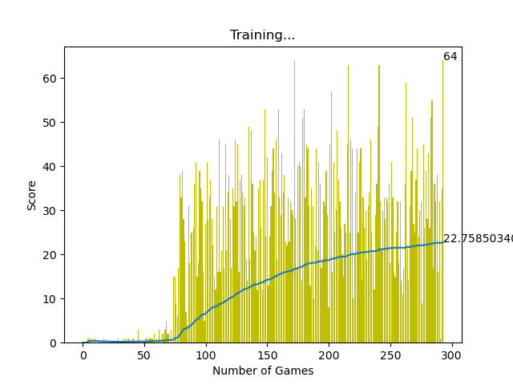

# Snake AI using Deep Q-Learning

## Code Performance



## How to build

- Clone the repository by typing the following command in the terminal

```
git clone https://github.com/LittleStar21/snake_ai.git
```

- Install python libraries

```
pip install requirements.txt
```

- Run the program

```
python agent.py
```
